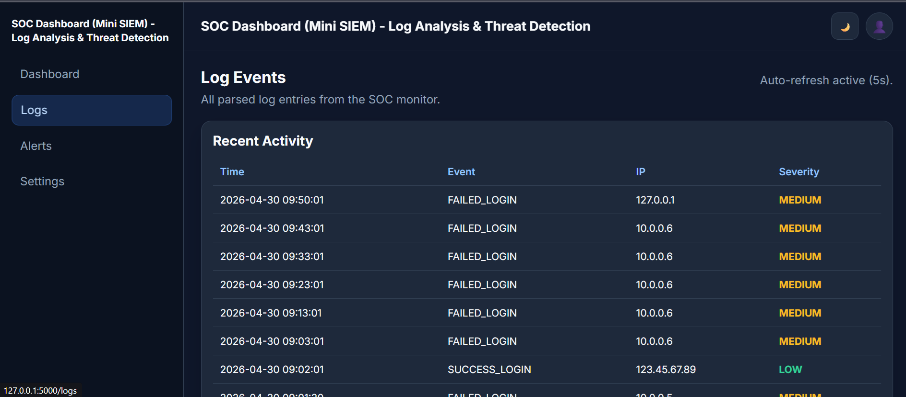
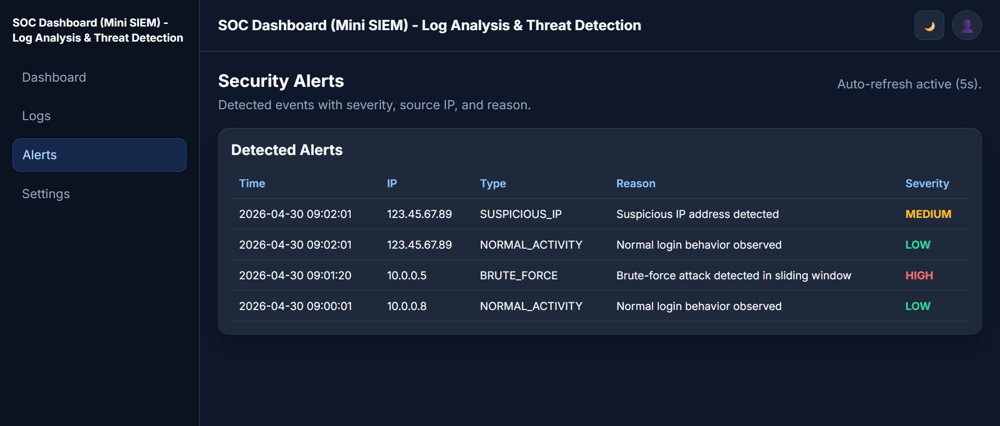
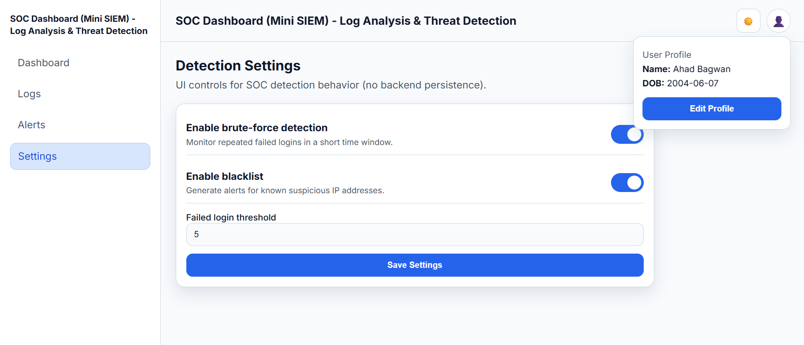

# SOC Dashboard (Mini SIEM) - Log Analysis & Threat Detection

## 🚀 Overview

This project is a simplified Security Operations Center (SOC) Dashboard that simulates how real-world SIEM systems monitor logs and detect suspicious activities.

It analyzes log files, detects brute-force attacks using sliding window logic, and generates alerts with severity levels.

---

## 🎯 Features

* 🔍 Log Analysis from structured logs
* 🚨 Brute-force detection (5 failed attempts within 2 minutes)
* ⚠️ Suspicious IP detection using blacklist
* 🛡️ Whitelist support to reduce false positives
* 📊 Severity-based alerts (Low, Medium, High)
* 🌐 REST API endpoints (`/api/logs`, `/api/alerts`, `/api/summary`)
* 💾 Optional SQLite-based alert storage
* 🖥️ Interactive dashboard UI

---

## 🧪 Testing

The system was tested using simulated scenarios:

* Normal traffic (no alerts)
* Brute-force attack simulation
* Time-spread attack (no false positives)
* Whitelisted IP validation
* API endpoint verification

---

## 🛠️ Tech Stack

* Python
* Flask
* JavaScript
* SQLite

---

## ▶️ How to Run

```bash
git clone https://github.com/AhadBagwan/soc-dashboard-mini-siem.git
cd soc-dashboard-mini-siem

pip install -r requirements.txt
python app.py
```

Open browser:

http://127.0.0.1:5000

---

## 📂 Project Structure

```text
SOC_Dashboard/
├── app.py
├── analyzer/
├── logs/
├── data/
├── static/
├── templates/
```

---

## 📸 Screenshots

**Dashboard Overview** - Professional SOC-style summary with live metrics and attack distribution.
.png>)

**Logs View** - Clean event table for fast review of recent security activity.


**Alerts View** - Severity-focused alert panel for quick threat triage.


**Settings View** - Structured controls for detection preferences and UI customization.


---

## 💡 Key Learnings

* Implemented sliding window detection logic
* Built log-based threat detection system
* Reduced false positives using whitelist logic
* Tested system using simulated attack scenarios

---

## 🔗 Author

Ahad Bagwan  
LinkedIn: [https://www.linkedin.com/in/ahad-bagwan](https://www.linkedin.com/in/ahadbagwan/)

