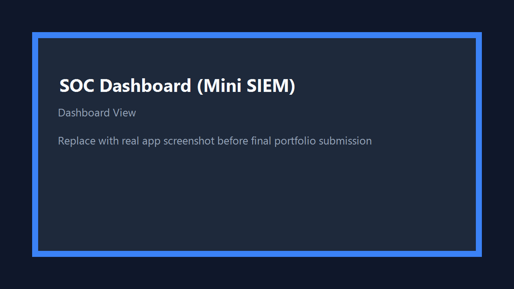

# SOC Dashboard (Mini SIEM) - Log Analysis & Threat Detection

A Flask-based mini SIEM dashboard for parsing logs, detecting suspicious behavior, and visualizing security alerts in a modern SOC-style interface.

## Features

- Log parsing and analysis pipeline
- Brute-force detection with sliding-window logic
- Suspicious IP detection via blacklist
- Severity-based alerts (LOW / MEDIUM / HIGH)
- Dashboard cards, tables, and attack chart
- Dedicated Logs, Alerts, and Settings pages
- Frontend-only user profile, first-time setup, and theme toggle (dark/light)

## Project Structure

```text
SOC_Dashboard/
├── app.py
├── analyzer/
│   ├── alert_store.py
│   └── log_analyzer.py
├── data/
│   ├── alerts.db
│   └── alerts.json
├── logs/
│   └── sample.log
├── screenshots/
│   ├── dashboard.png
│   └── alerts.png
├── static/
├── templates/
├── requirements.txt
└── .gitignore
```

## Local Setup

```powershell
python -m venv .venv
.\.venv\Scripts\python -m pip install -r requirements.txt
.\.venv\Scripts\python app.py
```

Open: `http://127.0.0.1:5000`

## API Endpoints

- `GET /api/logs`
- `GET /api/alerts`
- `GET /api/summary`

## Screenshots

### Dashboard



### Alerts


